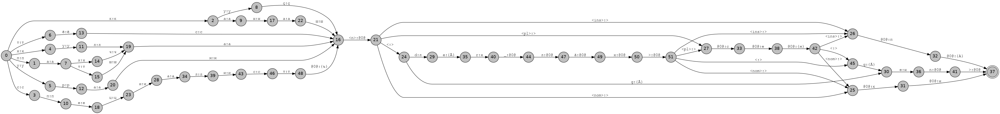
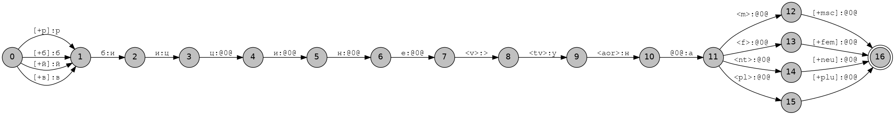
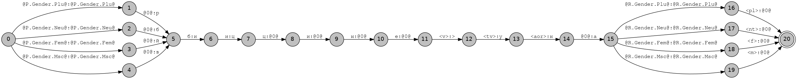
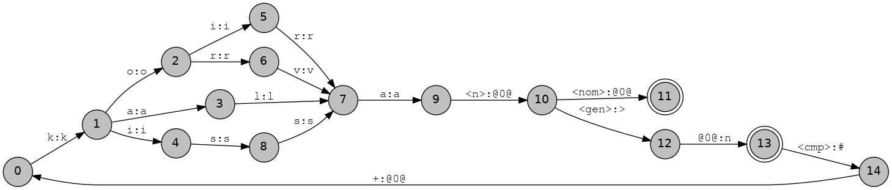
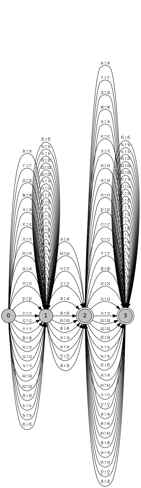

## Practical 02: Modelling Morphology with Finite-state Transducers using HFST
## Chuvash
```bash
> make && hfst-fst2strings chv.gen.hfst
```
I was able to follow the examples until I was asked to implement a rule to "expand a context to cause %{Ă%} to surface
as 0 after stem vowels." I still experience output matching the warning (the /аӑ/ morpheme appears when it should be 
/ӑ/). My transducer unfortunately looks nothing like the expected output; you can see the final product below:


**Q**: What does minimization do?  
**A**: According to the HFST [Documentation](https://github.com/hfst/hfst/wiki/HfstMinimize), ```hfst-minimize``` creates an "epsilon-free, deterministic transducer [with] as few
states as possible."

Minimization was done with the following bit of Bash:
```Bash
> hfst-minimise chv.gen.hfst  | hfst-fst2txt
```

## Avar
The Avar transducer looks like the example. See below:


After implementing the alternative approach using *flag diacritics*, I noticed that there are now nodes on each of
the four paths from the root node. Check it out:


One-liner in Bash for compiling & making a PNG of the output:
```bash
> hfst-lexc ava.lexc -o ava.lexc.hfst && hfst-twolc ava.twoc -o ava.twoc.hfst && hfst-invert ava.lexc.hfst | hfst-compose-intersect -1 - -2 ava.twoc.hfst | hfst-invert -o ava.gen.hfst && hfst-fst2txt ava.lexc.hfst | python3 att2dot.py  | dot -T png -o ava2.lexc.png
```

## Finnish
The Finnish transducer looks similar to the example but it has a few differences (see nodes 7 and 10 below).


Output matches the examples, however. Due to its cyclic nature, care must be taken to ensure you don't enter a loop.
When using ```hfst-fst2strings```, make sure to define the length of the output or the max number of cycles.

## Chuvash II: Electric Boogaloo
We return to the Chuvash transducer to add *productive derivation* and guess analysis. Pictured below is a visualization of
Chuvash's stems. 


## Conclusion
I ❤ FSTs