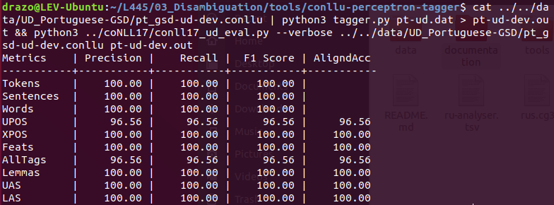

# Practical 3: Disambiguation
## Bash
One-liner for processing data (in this example, the **UD_Portuguese-GSD** dataset):
```bash
> cat ../../data/UD_Portuguese-GSD/pt_gsd-ud-dev.conllu | python3 tagger.py pt-ud.dat > pt-ud-dev.out && python3 ../coNLL17/conll17_ud_eval.py --verbose ../../data/UD_Portuguese-GSD/pt_gsd-ud-dev.conllu pt-ud-dev.out
```

## Feature Extraction Updates


I was able to get a modest improvement over the example (96.56 vs. 95.73). See ```/03_Disambiguation/conllu-perceptron-tagger/tagger.py```
, specifically the ```_get_features()``` function, for my ideas for new features. Anything with the "#new" comment is
 something I added to the provided code. I tried commenting out the given features as well to see if I could get 
 improvements, but +~1% is the most I could milk from this model.
 
 ## Finnish
 You can find the Finnish Model and output in ```/03_Disambiguation/```. I moved them there from the UDPipe folder for
 ease of access.