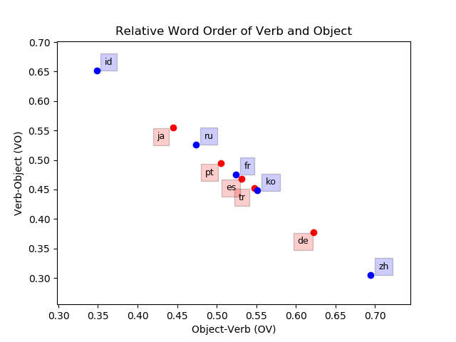

# Practical 04: Parsing / Dependency
## Bash
Listed below is the code used for parsing and evalutaing the **UD_Japanese-GSD** dataset.
```bash
> cd /04_Parsing/data/UD_Japanese-GSD/
> udpipe --tokenizer none --tagger none --train ja.udpipe < ja_gsd-ud-train.conllu
> udpipe --parse ja.udpipe < ja_gsd-ud-test.conllu > ja_gsd-test-out.conllu
> cat ja_gsd-ud-train.conllu | python3 ../../../03_Disambiguation/tools/conllu-perceptron-tagger/tagger.py -t ja-ud.dat
> cat ja_gsd-ud-test.conllu | python3 ../../../03_Disambiguation/tools/conllu-perceptron-tagger/tagger.py ja-ud.dat > ja-ud-test.out
> python3 ../../../03_Disambiguation/tools/coNLL17/conll17_ud_eval.py --verbose ja_gsd-ud-test.conllu ja-ud-test.out
```

## CoNLL17 Evaluation
My Japanese model received a **UPOS** score of 95.57, which is only slightly below the CoNLL17 score of the Portuguse
model from the last practical (96.56).

## Data
I used treebanks of 10 different languages:
1. Chinese
2. French
3. German
4. Indonesian
5. Japanese
6. Korean
7. Portuguese
8. Russian
9. Spanish
10. Turkish

## Plotting
To calculate *x* and *y*, I wrote a script (```04_Parsing\relative_word_order.py```) to parse my datasets. 
I was given code for plotting, which I modified heavily to improve readability. I used the following in my script
to calculate *x* and *y*:

| Axis | Order | Condition                                    |
|:----:|:-----:|:--------------------------------------------|
| x    | OV    | Word index is lower than (<) its head index  |
| y    | VO    | Word index is higher than (>) its head index |
  
The final plot is as follows:


